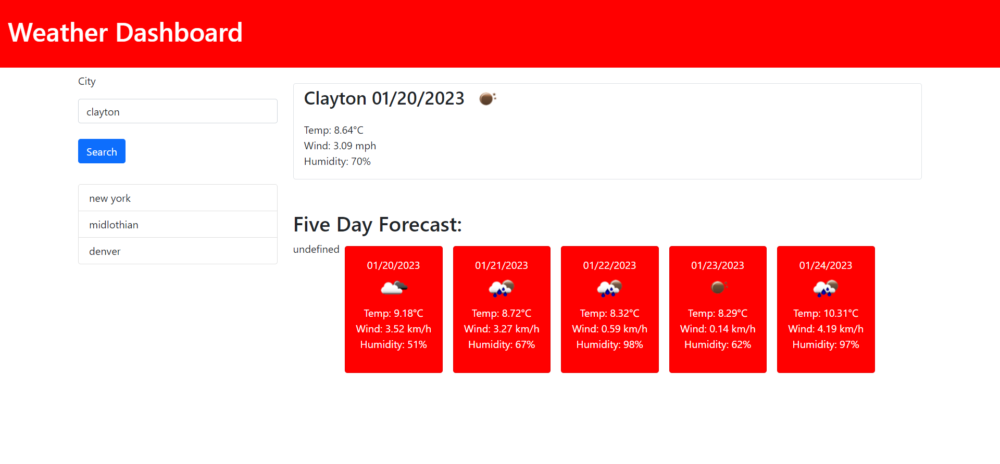

# weather-dashboard

## Table of Contents

-[Description](#description)

-[Deployed Page](#deployed-page)

-[Screenshot](#screenshot)

-[Credits](#credits)

-[Contact](#contact)

## Description

This application uses an API called OpenWeather to grab live weather data and dynamically create it and show on the page. You can search any city as long as it's valid and it will show current weather information as well as weather for the next five days.

## Deployed Page

https://garretta01.github.io/weather-dashboard/

## Screenshot

## Credits

This app uses Bootstrap, jQuery, Openweather and Dayjs APIs.

## Contact

- My Github: www.github.com/GarrettA01

- My Email: gman.anderson2001@gmail.com
